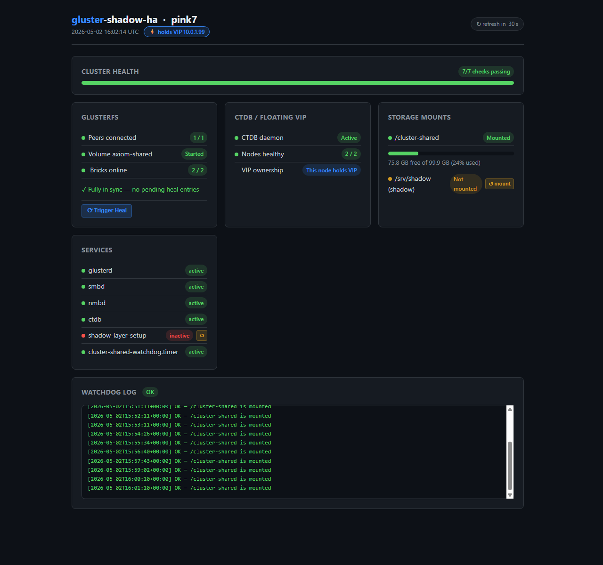
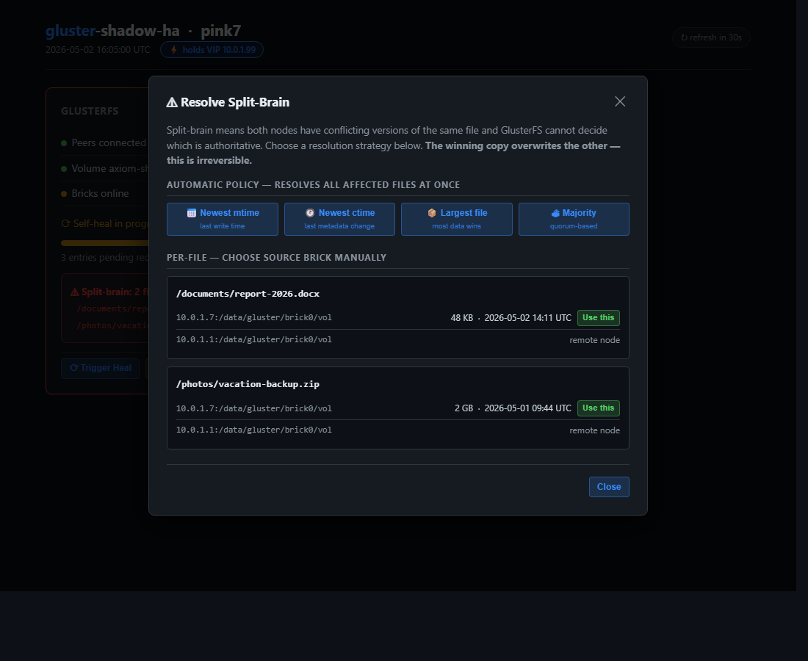
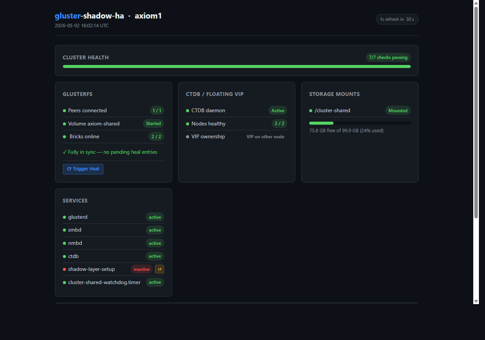

<div align="center">

# gluster-shadow-ha

**A self-healing two-node storage cluster that keeps working during network partitions and reconciles automatically when the link comes back.**

[](https://github.com/happy-pills-dev/gluster-shadow-ha/actions/workflows/shellcheck.yml)
[](https://ubuntu.com)
[](https://ubuntu.com)
[](LICENSE)

Built on **GlusterFS · Samba · CTDB · systemd**.  
No cloud dependency. No sync client. No conflict dialogs. Just a filesystem that heals itself.

</div>

---

## The core idea

Most two-node HA storage clusters face an unsolvable dilemma: when the replication
link breaks, you have to pick one of three bad options.

| Option | What happens | The problem |
|---|---|---|
| Both nodes freeze | Refuse writes until quorum | Your storage is down |
| One node wins | Minority goes read-only | Half your capacity disappears |
| Both nodes write | Independent writes on each | Split-brain data corruption to clean up manually |

This stack takes a **fourth path**. By giving Node A a **shadow serving layer** — a
filesystem abstraction that sits between Samba and the GlusterFS volume — the primary
node continues accepting reads and writes into a local buffer even when the replication
link is down. When the link comes back, GlusterFS's self-heal daemon reconciles both
sides automatically. No quorum freeze, no read-only degradation, no manual merge step.

```
NORMAL OPERATION
              Node A (primary)              Node B (secondary)
              ┌──────────────────┐          ┌──────────────────┐
clients─VIP──►│ Samba            │          │ Samba            │
              │  /srv/shadow  ───┼──────────┼──► /cluster-share│
              │  (shadow layer)  │◄ replicate►│  (direct mount) │
              └──────────────────┘          └──────────────────┘

DURING PARTITION (link between nodes is down)
              Node A                        Node B
              ┌──────────────────┐          ┌──────────────────┐
clients─VIP──►│ Samba ✓ serving  │          │ Samba ✓ serving  │
              │  /srv/shadow     │  ✗ link  │  /cluster-share  │
              │  writes → local  │  broken  │  writes → brick  │
              │  shadow buffer   │          │                  │
              └──────────────────┘          └──────────────────┘
                   ↓ link restored ↓
              GlusterFS self-heal merges both sides
              shadow buffer drains into replicated volume
              both nodes back in sync — unattended
```

The only limit on how long Node A can operate independently is the size of the local
shadow buffer disk. For typical real-world partitions (minutes to hours), this is
effectively unlimited.

---

## What it can do

| Capability | Detail |
|---|---|
| Shared read/write storage | Both nodes replicate the same data in real time |
| Windows drive mapping | Any client maps `\\<VIP>\share` as a drive letter over SMB |
| Transparent failover | Node goes down → VIP moves → clients reconnect, no data loss |
| **Independent operation during partition** | Node A keeps serving from its shadow buffer; Node B keeps serving from its brick — **neither freezes** |
| **Automatic reconciliation on rejoin** | GlusterFS self-heal merges both sides unattended — **no manual resolution step** |
| Bounded by disk, not by time | Shadow buffer size = local disk; typical partitions never fill it |
| Survives reboots | Hardened boot chain brings everything up in the right order, every time |
| Self-healing mounts | Watchdog detects and re-mounts dropped volumes within 60 seconds |
| Loud failures | Error README in the share root explains the problem to users when storage is degraded |
| Optional arbiter | Lightweight third node prevents split-brain without a full third replica |

---

## Quick start

### Option A — TUI wizard (recommended)

The wizard auto-detects your network, lists your disks, and writes the config for you:

```bash
git clone https://github.com/happy-pills-dev/gluster-shadow-ha
cd gluster-shadow-ha
sudo bash scripts/setup-wizard.sh
```

The wizard guides you through every option, validates your VIP, warns you about disk
erasure, and then runs `install.sh` automatically.

### Option B — direct installer

```bash
git clone https://github.com/happy-pills-dev/gluster-shadow-ha
cd gluster-shadow-ha

# Edit the 15-line variables block at the top of install.sh
nano install.sh

# Run on Node A (node0)
sudo ./install.sh --role node0

# Run on Node B in parallel
sudo ./install.sh --role node1

# Create the GlusterFS volume — run ONCE from Node A after both nodes are ready
sudo ./install.sh --role node0 --step gluster-volume-create

# Verify both nodes
./verify.sh
```

Map a drive on Windows: `\\<VIP>\myshare`

### Check cluster health

```bash
# Web dashboard — open in browser at http://<node-ip>:9000  (or /cluster/ via Caddy)
sudo systemctl status gluster-dashboard   # check if already running
# or run directly:
sudo python3 scripts/dashboard.py

# Command-line health check
./verify.sh          # human-readable
./verify.sh --json   # machine-readable
./verify.sh --quiet  # failures only (for cron monitoring)
```

---

## Architecture

```
Windows / Linux / macOS client
           │
           │  SMB  \\<VIP>\share
           ▼
    ┌─────────────────────────────────────────────────────────────┐
    │                    CTDB floating VIP                        │
    │          moves to the healthy node automatically            │
    └──────────────────┬──────────────────────────────────────────┘
                       │
         ┌─────────────┴──────────────┐
         │                            │
         ▼                            ▼
  ┌─────────────────┐          ┌─────────────────┐
  │   Node A        │          │   Node B        │
  │   PRIMARY       │          │   SECONDARY     │
  │                 │          │                 │
  │ smbd            │          │ smbd            │
  │  │              │          │  │              │
  │  ▼              │          │  ▼              │
  │ /srv/shadow ◄───┼── sync ──┼─ /cluster-share │
  │  │  (overlayfs) │          │  (direct mount) │
  │  ▼              │          │                 │
  │ /cluster-share  │          └────────┬────────┘
  │  (GlusterFS)    │                   │
  └────────┬────────┘                   │
           └──────────── GlusterFS ─────┘
              replica volume · self-heal on reconnect
              ┌──────────────┬──────────────┐
           brick A        brick B      arbiter (optional)
       /data/gluster/  /data/gluster/  lightweight,
         brick0/vol      brick0/vol    metadata only

During partition:
  Node A → shadow layer buffers writes locally  →  keeps serving ✓
  Node B → writes to its own brick              →  keeps serving ✓
  On reconnect: self-heal merges both sides     →  unattended   ✓
```

> Component deep-dive: **[docs/architecture.md](docs/architecture.md)**

---

## Requirements

**Hardware** — two machines (physical or VM):
- Ubuntu 24.04 LTS (also works on 22.04)
- 2+ CPU cores, 4+ GB RAM per node
- Two disks per node: OS disk + dedicated GlusterFS brick disk
- 1 Gbps LAN, same L2 segment (required for CTDB heartbeat)

**Network** — three IP addresses on the same subnet:
```bash
NODE0_IP="192.168.1.10"    # Node A primary IP
NODE1_IP="192.168.1.11"    # Node B primary IP
VIP="192.168.1.100"        # Floating VIP — must be unused
```

**Optional:** a lightweight arbiter node (RPi, cheap VPS, spare VM) to strengthen
split-brain prevention. See `templates/arbiter-cloud-init.yaml` for one-command setup.

---

## Configuration

Edit the variables block at the top of `install.sh`:

```bash
NODE0_IP="192.168.1.10"    # Node A primary IP
NODE1_IP="192.168.1.11"    # Node B primary IP
ARBITER_IP="192.168.1.12"  # Optional — set to "" to skip arbiter
VIP="192.168.1.100"        # Floating IP — must be unused on your network
VIP_NIC="eth0"             # NIC that carries the VIP (run: ip link)

GLUSTER_VOL="mydata"       # GlusterFS volume name
BRICK_DEV="/dev/sdb"       # Dedicated block device for the brick (WILL BE ERASED)

SMB_SHARE="myshare"        # Windows share name  → \\VIP\myshare
SMB_WORKGROUP="WORKGROUP"  # Workgroup / domain
```

Everything else is derived from these values. The TUI wizard (`scripts/setup-wizard.sh`)
auto-detects most of them and writes a `config.local` file instead of editing `install.sh`.

---

## Step-by-step installation guide

### Phase 0 — prepare both nodes

Run on **each node**:

```bash
apt update && apt upgrade -y
apt install -y \
    glusterfs-server glusterfs-client \
    ctdb samba samba-common-bin \
    lvm2 xfsprogs \
    net-tools iproute2 curl wget \
    mailutils postfix   # optional: for watchdog email alerts

systemctl enable glusterd ctdb smbd nmbd
# DO NOT start glusterd yet — it must start after the brick disk is ready
```

### Phase 1 — prepare the GlusterFS brick disk

Run on **each node**:

```bash
BRICK_DEV=/dev/sdb            # your dedicated brick disk
VG_NAME=gluster-vg
LV_NAME=brick0-lv
BRICK_MOUNT=/data/gluster/brick0

pvcreate  $BRICK_DEV
vgcreate  $VG_NAME $BRICK_DEV
lvcreate  -l 100%FREE -n $LV_NAME $VG_NAME
mkfs.xfs  /dev/$VG_NAME/$LV_NAME

mkdir -p  $BRICK_MOUNT
echo "/dev/$VG_NAME/$LV_NAME  $BRICK_MOUNT  xfs  defaults  0 2" >> /etc/fstab
mount -a

mkdir -p  $BRICK_MOUNT/vol    # GlusterFS requires a subdir, not the mount root
```

### Phase 2 — peer GlusterFS nodes

```bash
# On node0:
systemctl start glusterd
gluster peer probe 192.168.1.11    # probe node1
gluster peer probe 192.168.1.12    # probe arbiter (skip if no arbiter)

# On node1:
systemctl start glusterd
gluster peer probe 192.168.1.10    # establishes bidirectional trust

# Verify from either node:
gluster peer status
# → 2 Peers in state: Peer in Cluster (Connected)
```

### Phase 3 — create the GlusterFS volume

Run **once**, from node0:

```bash
# With arbiter (recommended):
gluster volume create mydata \
    replica 3 arbiter 1 \
    192.168.1.10:/data/gluster/brick0/vol \
    192.168.1.11:/data/gluster/brick0/vol \
    192.168.1.12:/data/gluster/arbiter \
    force

# Without arbiter (replica-2):
# gluster volume create mydata replica 2 \
#     192.168.1.10:/data/gluster/brick0/vol \
#     192.168.1.11:/data/gluster/brick0/vol force

gluster volume set mydata cluster.favorite-child-policy ctime
gluster volume start mydata
gluster volume status mydata    # all bricks should show "Y" in Online column
```

### Phase 4 — mount the GlusterFS volume on both nodes

**Important:** use `x-systemd.requires` so the mount waits for glusterd — not
just for the network.

```bash
# On node0 — add to /etc/fstab:
echo "192.168.1.10:/mydata  /cluster-shared  glusterfs  \
defaults,_netdev,x-systemd.requires=glusterd.service,\
x-systemd.after=glusterd.service,x-systemd.mount-timeout=30s,\
backup-volfile-servers=192.168.1.11  0 0" >> /etc/fstab

# On node1 — same but source IP is node1's own IP:
echo "192.168.1.11:/mydata  /cluster-shared  glusterfs  \
defaults,_netdev,x-systemd.requires=glusterd.service,\
x-systemd.after=glusterd.service,x-systemd.mount-timeout=30s,\
backup-volfile-servers=192.168.1.10  0 0" >> /etc/fstab

mkdir -p /cluster-shared
systemctl daemon-reload
mount /cluster-shared
mountpoint /cluster-shared    # must print "is a mountpoint"
```

> **Why `x-systemd.requires=glusterd.service`?**  
> Without it, the mount unit only depends on `network-online.target` — not on
> `glusterd.service`. On this topology the client connects to its own glusterd.
> The mount fires before glusterd is ready and silently fails, serving an empty
> share with no errors anywhere. See [docs/gotchas.md](docs/gotchas.md) #1.

If you use a manual `.mount` unit instead of fstab, see
`configs/systemd/cluster-shared.mount` for the canonical template.
**Do NOT put `_netdev` in the `[Mount] Options` of a manual unit** — it injects
a hidden condition in systemd 255 that causes a boot-time mount loop.
See [docs/gotchas.md](docs/gotchas.md) #2.

### Phase 5 — harden glusterd boot ordering

Ensures the GlusterFS volume is force-started before dependent mounts fire:

```bash
mkdir -p /etc/systemd/system/glusterd.service.d
cat > /etc/systemd/system/glusterd.service.d/wait-for-internal-net.conf << 'EOF'
[Unit]
After=sys-subsystem-net-devices-eth0.device network-online.target
Wants=sys-subsystem-net-devices-eth0.device

[Service]
ExecStartPost=/bin/bash -c \
  'sleep 5 && gluster volume start mydata force 2>&1 | logger -t glusterd-poststart || true'
EOF
# Replace eth0 with your NIC name (run: ip link)

systemctl daemon-reload
```

### Phase 6 — CTDB (floating VIP + Samba coordination)

```bash
# On both nodes — write the VIP file (same content on both):
cat > /etc/ctdb/public_addresses << 'EOF'
192.168.1.100/24 eth0
EOF
# Replace VIP and NIC name as needed

# Write the nodes file (same on both):
cat > /etc/ctdb/nodes << 'EOF'
192.168.1.10
192.168.1.11
EOF

# Minimal ctdb.conf:
cat > /etc/ctdb/ctdb.conf << 'EOF'
[logging]
location = file:/var/log/ctdb/ctdb.log
log level = NOTICE

[cluster]
transport = tcp
node address = 192.168.1.10    # ← change per node

[legacy]
lmaster role = yes
EOF

systemctl enable --now ctdb
ctdb status    # both nodes should show OK
```

### Phase 7 — Samba

```bash
cat > /etc/samba/smb.conf << 'EOF'
[global]
    workgroup = WORKGROUP
    server string = Cluster Node %h
    clustering = yes
    idmap config * : backend = tdb
    ctdbd socket = /var/run/ctdb/ctdbd.socket
    private dir = /var/lib/samba/private

[myshare]
    comment = Cluster Shared Storage
    # node0: path points to the shadow overlay (set in Phase 10)
    # node1: path points directly to the GlusterFS mount
    path = /cluster-shared/data
    browseable = yes
    read only = no
    valid users = @sambausers
    create mask = 0664
    directory mask = 0775
EOF

# On node0: override to use the shadow overlay path
sed -i 's|path = /cluster-shared/data|path = /srv/shadow/data|' /etc/samba/smb.conf

smbpasswd -a <username>
testparm -s                    # must return no errors
systemctl restart smbd nmbd
```

### Phase 8 — systemd drop-ins: prevent silent empty-directory failures

Without these drop-ins, `smbd` starts even if the underlying storage is missing,
serving an empty share with no error — extremely hard to diagnose.

**node0** (depends on the shadow overlay service):
```bash
mkdir -p /etc/systemd/system/smbd.service.d
cp configs/systemd/smbd.service.d/override-node0.conf \
   /etc/systemd/system/smbd.service.d/cluster-required.conf
```

**node1** (depends directly on the mount unit):
```bash
mkdir -p /etc/systemd/system/smbd.service.d
cp configs/systemd/smbd.service.d/override-node1.conf \
   /etc/systemd/system/smbd.service.d/cluster-required.conf
```

**On both nodes** — install the error README handler (writes a plain-English
explanation file to the share root whenever storage is degraded):
```bash
cp configs/systemd/smbd-error-handler.conf \
   /etc/systemd/system/smbd.service.d/error-handler.conf
```

```bash
systemctl daemon-reload
```

### Phase 9 — watchdog timer

Catches runtime mount drops, network blips, and FUSE crashes. Fires every 60 seconds.

```bash
# Install the watchdog script
cp configs/watchdog/cluster-shared-watchdog.sh /usr/local/sbin/
chmod +x /usr/local/sbin/cluster-shared-watchdog.sh

# Install the systemd units
cat > /etc/systemd/system/cluster-shared-watchdog.service << 'EOF'
[Unit]
Description=Re-mount /cluster-shared if it dropped
After=glusterd.service

[Service]
Type=oneshot
ExecStart=/usr/local/sbin/cluster-shared-watchdog.sh
EOF

cp configs/watchdog/cluster-shared-watchdog.timer \
   /etc/systemd/system/cluster-shared-watchdog.timer

systemctl daemon-reload
systemctl enable --now cluster-shared-watchdog.timer
```

> **Always use `systemctl start 'cluster\x2dshared.mount'` in recovery scripts —
> never raw `mount /cluster-shared`.**  
> Raw `mount` bypasses systemd's unit lifecycle. Systemd detects the untracked FUSE
> mount and immediately unmounts it if the unit is in a failed/condition-skipped state,
> creating an infinite remount loop. See [docs/gotchas.md](docs/gotchas.md) #3.

### Phase 10 — node0 shadow overlay (write buffer)

Allows node0 to buffer writes locally, keeping the share available even if the
GlusterFS connection is dropped:

```bash
mkdir -p /opt/shadow-layer/data /opt/shadow-layer/work /srv/shadow/data

cat > /etc/systemd/system/shadow-layer-setup.service << 'EOF'
[Unit]
Description=Mount shadow overlay filesystem
After=cluster-shared.mount
Requires=cluster-shared.mount
ConditionPathIsMountPoint=/cluster-shared

[Service]
Type=oneshot
RemainAfterExit=yes
ExecStart=/bin/mount -t overlay overlay \
    -o lowerdir=/cluster-shared,upperdir=/opt/shadow-layer/data,workdir=/opt/shadow-layer/work \
    /srv/shadow
ExecStop=/bin/umount /srv/shadow

[Install]
WantedBy=multi-user.target
EOF

systemctl daemon-reload
systemctl enable --now shadow-layer-setup
mountpoint /srv/shadow    # must print "is a mountpoint"
```

---

## Verification

Run after every installation and after every reboot:

```bash
./verify.sh
```

Expected output:
```
gluster-shadow-ha verify — nodeA [node0] — 2026-05-02 12:15:00 UTC
  PASS  glusterd.service active
  PASS  gluster peer: at least 1 connected
  PASS  volume mydata is Started
  PASS  /cluster-shared is a mountpoint
  PASS  /srv/shadow is a mountpoint        (node0 only)
  PASS  smbd.service active
  PASS  ctdb.service active
  PASS  cluster-shared-watchdog.timer active
  PASS  no Condition skip for cluster-shared

  Pass: 9   Fail: 0   Warn: 0
```

**Always run `verify.sh` after every reboot.** These failure modes are invisible
during normal operation and only surface on a cold boot after a configuration change.

### Web dashboard

See the **[Web dashboard](#web-dashboard)** section below for full details, screenshots,
and setup instructions.

---

## Web dashboard

`scripts/dashboard.py` is a self-refreshing status and control panel that runs on
every cluster node. It requires no external database or message broker — just Python
and Flask (or the stdlib fallback if Flask is not installed).

### Overview

[](docs/dashboard-overview.png)

> *axiom0 (node0) — 7/7 checks passing, holding the floating VIP, watchdog log scrolling green.*

The dashboard auto-refreshes every 30 seconds. Click the **↻ refresh** badge to reload
immediately. The countdown pauses while an action is in-flight or a modal is open so
you don't lose your place.

---

### What each panel shows

#### Cluster health bar
A single at-a-glance score (N/7 checks passing). The bar turns yellow below 100 % and
red below 70 %. The seven checks are:

| # | Check |
|---|---|
| 1 | `glusterd.service` is active |
| 2 | GlusterFS volume is in **Started** state |
| 3 | `/cluster-shared` is mounted |
| 4 | `smbd.service` is active |
| 5 | `ctdb.service` is active |
| 6 | CTDB reports at least one OK node |
| 7 | Watchdog log last entry is `OK` |

#### GlusterFS panel
Shows peer count, volume state, brick online ratio, and self-heal status.
A pulsing yellow bar means heal entries are pending; a green line means the volume
is fully in sync. A **⚠ Split-brain** alert appears when `gluster volume heal … info
split-brain` reports affected files — click **Resolve…** to open the interactive modal.

#### CTDB / Floating VIP panel
Shows whether the CTDB daemon is active, how many nodes are healthy, and whether
*this* node currently holds the floating VIP. The ⚡ badge in the header repeats the
VIP address for instant recognition.

#### Storage mounts panel
Shows mount state and disk usage for `/cluster-shared` (both nodes) and `/srv/shadow`
(node0 only). A disk bar turns yellow above 75 % used and red above 90 %.

#### Services panel
Live `systemctl is-active` state for every critical service:
`glusterd`, `smbd`, `nmbd`, `ctdb`, `shadow-layer-setup`, `cluster-shared-watchdog.timer`.

#### Watchdog log panel
Last 15 lines of `/var/log/cluster-shared-watchdog.log`, colour-coded:
- 🟢 green — `OK — /cluster-shared is mounted`
- 🟡 yellow — recovery or `NOT mounted`
- 🔴 red — `FAILED`

---

### Interactive controls

Every panel that can be in a bad state surfaces a one-click fix button.
A confirmation dialog appears before any destructive action; a toast notification
slides in from the bottom-right with the command output.

| Situation | Control |
|---|---|
| Volume needs a heal cycle | **⟳ Trigger Heal** — fires `gluster volume heal <vol>` |
| Split-brain detected | **⚠ Resolve Split-Brain** — opens the modal below |
| A service is `inactive` | **↺** restart button next to the service row |
| CTDB is down | **↺ restart** button in the CTDB panel |
| A mount is not mounted | **↺ mount** button in the Mounts panel |

#### Split-brain resolution modal

[](docs/dashboard-splitbrain.png)

> *The modal shows two affected files with brick paths, file sizes, and modification
> times. The local-brick copy has a green **Use this** button; the remote-node brick
> is labelled "remote node" (stat it from the other node's dashboard).*

**Automatic policy** — resolves all split-brain files at once by setting
`cluster.favorite-child-policy` to one of:

| Policy | Keeps |
|---|---|
| 📅 Newest mtime | the copy with the most recent write time |
| 🕐 Newest ctime | the copy with the most recent metadata change |
| 📦 Largest file | the copy with the most bytes |
| 🗳 Majority | quorum vote (needs an arbiter for true majority) |

**Per-file manual** — if you know exactly which brick has the right copy, click
**Use this** on that brick row. This runs `gluster volume heal <vol> split-brain
source-brick <brick> <file>` for that one file only.

> **Note:** brick stats are only available for bricks that are local to the node
> running the dashboard. For the remote brick, open the other node's dashboard.

---

### Two-node view

Both nodes run an independent dashboard instance. Each shows its own perspective —
which node holds the VIP, whether that node's local shadow mount is up, etc.

| Node | Dashboard URL |
|---|---|
| axiom0 (node A) | `http://192.168.0.120/cluster/` |
| axiom1 (node B) | `http://192.168.0.110/cluster/` |

[](docs/dashboard-axiom1.png)

> *axiom1 — same 7/7 health score; VIP ownership shows "VIP on other node" because
> axiom0 currently holds it. No shadow-mount row because node1 has no shadow overlay.*

---

### Setup — deploy the dashboard on a new node

```bash
# 1. Copy the script to a permanent location
sudo mkdir -p /opt/gluster-shadow-ha
sudo cp scripts/dashboard.py /opt/gluster-shadow-ha/

# 2. Create a venv and install Flask (avoids Debian system-package conflicts)
sudo python3 -m venv /opt/gluster-shadow-ha/.venv
sudo /opt/gluster-shadow-ha/.venv/bin/pip install flask psutil

# 3. Write the systemd service unit
sudo tee /etc/systemd/system/gluster-dashboard.service > /dev/null << 'EOF'
[Unit]
Description=gluster-shadow-ha web status dashboard
After=network.target glusterd.service ctdb.service
Wants=glusterd.service

[Service]
Type=simple
ExecStart=/opt/gluster-shadow-ha/.venv/bin/python3 /opt/gluster-shadow-ha/dashboard.py
Restart=on-failure
RestartSec=15
Environment=DASHBOARD_PORT=9000
Environment=GLUSTER_VOL=axiom-shared
Environment=CLUSTER_MOUNT=/cluster-shared
Environment=SHADOW_MOUNT=/srv/shadow
Environment=WATCHDOG_LOG=/var/log/cluster-shared-watchdog.log
WorkingDirectory=/opt/gluster-shadow-ha
StandardOutput=append:/var/log/gluster-dashboard.log
StandardError=append:/var/log/gluster-dashboard.log

[Install]
WantedBy=multi-user.target
EOF

# 4. Enable and start
sudo systemctl daemon-reload
sudo systemctl enable --now gluster-dashboard
sudo systemctl status gluster-dashboard

# 5. Verify
curl -s http://localhost:9000/api/status | python3 -m json.tool | head -20
```

Adjust `GLUSTER_VOL`, `CLUSTER_MOUNT`, and `SHADOW_MOUNT` to match your environment.

#### Expose on port 80 via Caddy

If the node already runs a Caddy reverse proxy, add a `/cluster` handle to your
Caddyfile (replace `NODE_IP` with the node's LAN IP):

```caddy
# In your http :80 block:
handle /cluster* {
    uri strip_prefix /cluster
    reverse_proxy NODE_IP:9000
}

# In your https block (before the catch-all):
handle /cluster* {
    uri strip_prefix /cluster
    reverse_proxy NODE_IP:9000
}
```

Reload Caddy after editing:
```bash
docker exec <caddy-container> caddy reload --config /etc/caddy/Caddyfile
```

#### API endpoints

| Method | Path | Description |
|---|---|---|
| `GET` | `/` | Full HTML dashboard |
| `GET` | `/api/status` | JSON snapshot of all cluster state |
| `GET` | `/api/splitbrain_detail` | Per-file, per-brick stats for split-brain files |
| `POST` | `/api/action` | Execute a cluster action (JSON body) |

`POST /api/action` accepts a JSON body with an `action` field:

```jsonc
// Trigger a full self-heal cycle
{ "action": "heal" }

// Resolve all split-brain by policy (mtime | ctime | size | majority)
{ "action": "heal_splitbrain_policy", "policy": "mtime" }

// Resolve one file from a specific brick
{ "action": "heal_splitbrain_brick",
  "brick": "10.0.1.7:/data/gluster/brick0/vol",
  "file": "/documents/report.docx" }

// Restart an allowlisted service
{ "action": "restart_service", "service": "glusterd" }

// Re-mount a filesystem (lazy-unmount then mount from fstab)
{ "action": "remount", "target": "cluster" }   // or "shadow"
```

All actions return `{ "ok": true|false, "output": "..." }`.

---

## Adding an arbiter node

An arbiter stores only GlusterFS metadata — no file data — so a Raspberry Pi, cheap
VPS, or spare VM is enough. It strengthens split-brain prevention without the cost of
a full third replica.

```bash
# On any cloud provider or Raspberry Pi:
# Paste templates/arbiter-cloud-init.yaml as the instance user-data
# The node configures itself and prints next steps to /etc/motd on first login

# From node0, after the arbiter boots:
gluster peer probe <ARBITER_IP>

# Re-create the volume with arbiter (if not done in Phase 3):
gluster volume create mydata replica 3 arbiter 1 \
    192.168.1.10:/data/gluster/brick0/vol \
    192.168.1.11:/data/gluster/brick0/vol \
    <ARBITER_IP>:/data/gluster/arbiter \
    force
```

---

## Known gotchas

These are real failure modes from production. The installer handles all of them;
knowing why helps when debugging.

> Full root-cause analysis: **[docs/gotchas.md](docs/gotchas.md)**

### 1. Boot-order race — fstab mount fires before glusterd is ready

`_netdev` waits for the network, not for glusterd. On a self-referencing topology
(node is both client and server), the mount fires, gets connection-refused, and
silently succeeds (empty directory). Fix: always add
`x-systemd.requires=glusterd.service` to fstab options.

### 2. `_netdev` in a manual `.mount` unit injects a hidden condition (systemd 255)

In Ubuntu 24.04, `_netdev` in `[Mount] Options` of a hand-written `.mount` unit
injects an implicit `ConditionNetworkConnectivity` that is invisible in
`systemctl cat` output. It races at boot, silently skips the unit, then a recovery
watchdog that calls raw `mount` creates a FUSE mount that systemd immediately
cleans up — 1-minute remount/unmount loop forever.
Fix: use explicit `After=` / `Requires=` in `[Unit]` and no `_netdev` in `[Mount]`.

### 3. Watchdog must route through systemctl — not raw `mount`

`mount /cluster-shared` bypasses systemd's lifecycle. If the unit has failed/condition
flags, systemd unmounts the FUSE mount seconds after the watchdog exits.
Fix: `systemctl start 'cluster\x2dshared.mount'`.

### 4. Samba silently serves an empty directory

If the storage mount failed, `smbd` starts and serves an empty share. No error
anywhere. Fix: add a `Requires=` drop-in to `smbd.service.d/` (Phase 8 above) and
install `smbd-error-handler.conf` to write a visible README into the share root.

### 5. Always reboot-test after any infrastructure change

Failure modes 1–3 are invisible during normal operation. After any config change,
reboot the node and run `./verify.sh`. If all checks pass, the change is complete.

---

## Troubleshooting

| Symptom | First check |
|---|---|
| Share empty or partial | `mountpoint /cluster-shared` on the node holding the VIP |
| Share not accessible | `ctdb status` — is the VIP assigned to any node? |
| VIP not assigning | `systemctl status ctdb` — check `/etc/ctdb/nodes` IPs |
| Mount missing after reboot | `journalctl -b 0 \| grep -i 'condition.*skip'` |
| Watchdog loop (mounts then disappears) | Check for `_netdev` in the `.mount` Options |
| GlusterFS split-brain | `gluster volume heal mydata info split-brain` |
| Brick offline | `gluster volume status` — identify the down peer |
| README_FIRST.txt in the share | Read it — it says exactly what's wrong |

Full diagnostic dump:
```bash
gluster peer status
gluster volume status
ctdb status
journalctl -b 0 | grep -E '(glusterd|ctdb|smbd|cluster-shared)' | tail -40
systemctl status smbd ctdb glusterd cluster-shared-watchdog.timer
tail -20 /var/log/cluster-shared-watchdog.log
```

---

## Repository layout

```
gluster-shadow-ha/
├── README.md                      this guide
├── install.sh                     automated installer — all phases, idempotent
├── verify.sh                      post-install and post-reboot health checks
├── index.html                     GitHub Pages landing page
│
├── scripts/
│   ├── setup-wizard.sh            interactive TUI installer (whiptail)
│   └── dashboard.py               web status dashboard (Flask / stdlib fallback)
│
├── templates/
│   └── arbiter-cloud-init.yaml    cloud-init for arbiter node (VPS or RPi)
│
├── configs/
│   ├── smb.conf                   Samba config template
│   ├── ctdb.conf                  CTDB config template
│   ├── public_addresses           CTDB VIP file template
│   ├── systemd/
│   │   ├── cluster-shared.mount   mount unit template (no _netdev — see gotchas #2)
│   │   ├── smbd-error-handler.conf  writes README to share when storage is degraded
│   │   └── smbd.service.d/
│   │       ├── override-node0.conf  smbd dependency drop-in for node0 (shadow overlay)
│   │       └── override-node1.conf  smbd dependency drop-in for node1 (direct mount)
│   └── watchdog/
│       ├── cluster-shared-watchdog.sh     recovery script (systemctl, not raw mount)
│       └── cluster-shared-watchdog.timer  systemd timer unit
│
├── docs/
│   ├── architecture.md            component deep-dive and partition behaviour
│   ├── gotchas.md                 all known failure modes with root causes and fixes
│   ├── dashboard-overview.png     screenshot — full dashboard (axiom0)
│   ├── dashboard-axiom1.png       screenshot — dashboard from node1's perspective
│   └── dashboard-splitbrain.png   screenshot — split-brain resolution modal
│
└── .github/
    └── workflows/
        └── shellcheck.yml         CI: lint all shell scripts on every push
```

---

## Why this approach

> **Use boring, well-understood tools with explicit configuration
> over smart abstractions with hidden behaviour.**

Ceph, NFS-Ganesha with Pacemaker, and hyperconverged Kubernetes are the right tools
at scale. For a two-node lab, home office, or small production workload, they are
significant over-engineering: complex to configure, expensive to monitor, and fragile
when you only have two nodes (quorum becomes painful).

This stack takes the opposite bet:

- **GlusterFS replica-2/3** — inspect brick state with one command. Recovery from
  a failed node: start the node, watch it self-heal.
- **CTDB** — the standard HA layer for Samba clusters since 2007. Every two-node
  failover edge case has already been hit and documented.
- **Systemd** — explicit `Requires=` and `After=`. No hidden state machine.
  The dependency graph is exactly what you wrote.

The tradeoff is that you manage the pieces yourself. The payoff is that when something
goes wrong, you read the journal, understand what happened, and fix it in minutes —
not hours of event archaeology.

---

## Who it's for

**Laptop + home server** — your laptop is Node A. Your always-on home server is Node B.
At home, both are in sync in real time. Unplug and leave — the laptop keeps writing,
nothing breaks. Come back, plug in, within seconds the home server has everything you
wrote while away. No Dropbox, no rsync cron job, no "which version is newer?" dialog.

**Two office workstations** — shared project drive. One machine goes down for
maintenance; the other keeps working. When it comes back, it catches up silently.

**Development node + standby** — the production node uses the shadow layer as a
staging buffer. Writes land immediately, replicate in the background, drain when
the secondary returns.

**Home lab NAS** — two repurposed mini-PCs or old laptops. A Windows machine maps
the share as a drive letter. Full HA SMB with floating IP, no vendor lock-in,
complete visibility into everything happening — for less than the cost of a consumer NAS.

---

## License

MIT — fork it, adapt it, contribute back.

## Contributing

Issues and PRs welcome.  
When reporting a problem, include the output of `./verify.sh` and:

```bash
journalctl -b 0 | grep -E '(glusterd|ctdb|smbd|cluster)' | tail -40
gluster peer status
gluster volume status
```

## Author

**axiom.systems** — admin at axiom.systems
